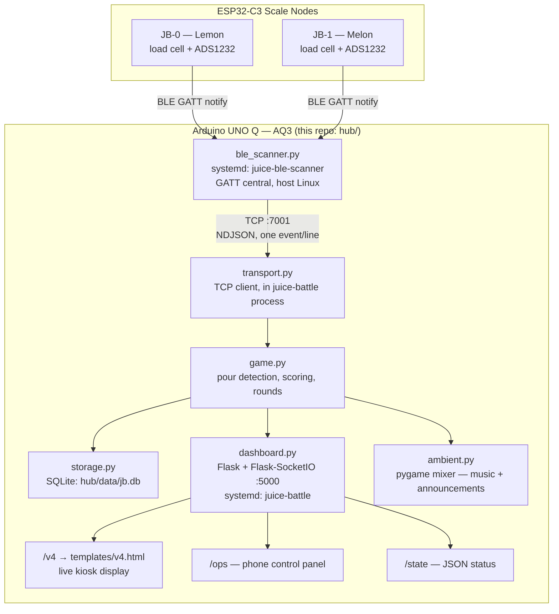

# Juice Battle — Hub

*Python backend running on the Arduino UNO Q hub (hostname `AQ3`) — receives live weight
telemetry from two BLE scale nodes, scores the game, and serves the crowd-facing dashboard.*


---

## 🌌 Overview

Two glass jars compete at a market stall — visitors pour juice, and whoever pours more
glasses wins the round. Each jar sits on a load-cell platform driven by its own ESP32-C3
node (`JB-0`, `JB-1`). The nodes do raw sensing only; **all game logic lives here in the
hub** — this is the orchestrator, not the sensor.

---

## 🏗️ Architecture



### Step-by-step data flow
1. **Sensing** — each node reads its load cell, applies calibration (`cal_to_grams`), and streams `HEARTBEAT` / `POUR_ACTIVE` / `POUR_SETTLED` / `DIAG` messages over BLE GATT notify. Nodes never decide what counts as a pour — that's the hub's job.
2. **`ble_scanner.py`** connects to both nodes as GATT central, decodes the binary payload, and republishes each event as one NDJSON line on a local TCP server (`:7001`). Runs as its own systemd service (`juice-ble-scanner`) — kept separate from the main app so a BLE hiccup can't take down the game or dashboard.
3. **`transport.py`** is a TCP client inside the main `juice-battle` process — connects to `:7001`, parses NDJSON, fires callbacks into `game.py`.
4. **`game.py`** owns all scoring logic: noise-floor filtering (3×σ), disturbance/bounce suppression, plausibility ceiling (jar-lift detection), split-pour accumulation, glass counting, round-end triggering. This is the only place pour/glass decisions get made.
5. **`storage.py`** persists every scored pour event, session, and round result to SQLite (`hub/data/jb.db`).
6. **`dashboard.py`** pushes live state to the kiosk display and ops panel over Socket.IO (500ms loop) and serves the JSON `/state` endpoint. The live kiosk route is `/v4` (renders `templates/v4.html`) — reached via a splash screen (`static/splash.html`) that redirects there on load. `/`, `/v2`, and `/v3` are earlier dashboard iterations still served but not what the kiosk actually shows.
7. **`ambient.py`** handles background music and round-begin/glass-scored sound effects via `pygame.mixer`.

---

## 📂 Files in this directory

| File | Role |
|---|---|
| `main.py` | Orchestrator — wires the modules below together. Owns zero logic. |
| `config.py` | All tunable constants (ports, thresholds, paths). Single source of truth. |
| `ble_scanner.py` | GATT central + TCP NDJSON server. Runs as `juice-ble-scanner` service. |
| `transport.py` | TCP client — hands parsed events to `game.py`. |
| `game.py` | Game engine — pour detection, scoring, rounds, sessions. |
| `storage.py` | SQLite persistence layer. |
| `dashboard.py` | Flask + Socket.IO web server, kiosk/ops UI, `/state` API. |
| `ambient.py` | Background music + sound effect playback. |
| `game_test.py`, `storage_test.py` | Test harnesses for the above. |
| `setup.sh` | First-time board setup (installs deps, systemd units). |
| `deploy.sh` | Restart services after a code change. |
| `SYSTEM_RUNBOOK.md` | Full operations reference — start here for day-of-stall ops. |

> `game_engine.py`, `persona_engine.py`, and `receiver.py` also exist in this directory but are empty, unused stubs left over from the original 2026-07-10 bootstrap scaffold — superseded by `game.py` / `ble_scanner.py`+`transport.py` respectively. Not part of the running system; candidates for deletion.
>
> `inject_v3.py` is a one-time migration script (already run) that patched the `/v3` route and template into `dashboard.py` — not a live runtime component. `templates/v3.html` and `templates/v4.html` are the actual served templates; `/v4` is what the kiosk shows.

---

## 🔌 Nodes & network

| What | Value |
|---|---|
| Hub | Arduino UNO Q, hostname `AQ3`, `192.168.88.25` |
| JB-0 (Lemon) | ESP32-C3, MAC `70:AF:09:32:F3:C2` |
| JB-1 (Melon) | ESP32-C3, MAC `AC:27:6E:53:DC:4A` (chip replaced 2026-08-13) |
| BLE transport | `:7001` — TCP, NDJSON, `ble_scanner.py` → `transport.py` |
| Dashboard | `http://192.168.88.25:5000/v4` (kiosk) |
| Ops panel | `http://192.168.88.25:5000/ops` (phone) |
| State API | `http://192.168.88.25:5000/state` |

## ⚙️ Key config (`config.py`)

| Setting | Value | Note |
|---|---|---|
| `GLASS_VOLUME_G` | 150.0 | Grams per scored glass |
| `ROUND_SIZE` | 2 | Glasses per round — **set to 10 before a real stall**, see runbook |
| `DASHBOARD_PORT` | 5000 | Flask/Socket.IO port |
| `TRANSPORT_PORT` | 7001 | `ble_scanner.py` ↔ `transport.py` NDJSON pipe |
| `POUR_SIGMA_K` | 3.0 | Noise floor multiplier (3σ rule) |
| `POUR_WINDOW_S` | 20.0 | Split-pour accumulation window |

---

## ⚙️ Setup & Installation

### First time on a new board
```bash
cd ~/ArduinoApps/juice_battle
bash hub/setup.sh   # installs python3-dbus, systemd services, enables both on boot
```

### After any code change
```bash
bash hub/deploy.sh   # restarts juice-ble-scanner + juice-battle
```

---

## 🩺 Monitoring & quick health check

```bash
# Services
sudo systemctl status juice-ble-scanner juice-battle --no-pager | grep -E "Active|running|failed"

# Live BLE scanner log
sudo journalctl -u juice-ble-scanner -f | grep -E "NODE_CONNECTED|HEARTBEAT"

# Live game/app log
sudo journalctl -u juice-battle -f

# Raw NDJSON event stream
nc localhost 7001

# Current game state
curl -s http://localhost:5000/state | python3 -m json.tool
```

**Normal operation looks like:**
```
journalctl -u juice-ble-scanner:
  [HEARTBEAT] node=0 delta=0.0g sigma=2.8g seq=N   (~once/sec per node, idle)

nc localhost 7001:
  {"msg":"HEARTBEAT","node":0,"delta_g":0.0,"sigma_g":2.8,"seq":N}
```

For anything beyond a quick check — fault diagnosis, startup sequence, subsystem
controls, shutdown — see **[`SYSTEM_RUNBOOK.md`](SYSTEM_RUNBOOK.md)**, the full
operations reference.
